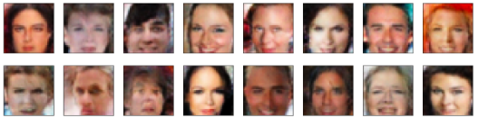
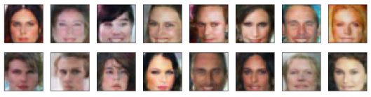
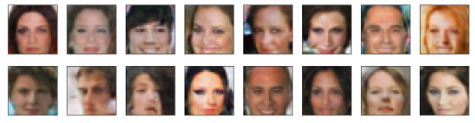
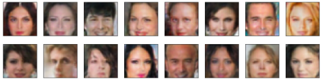
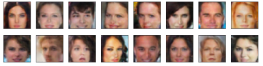

# Face-Generator-DCGAN
generate new celeb faces using deep DCGAN.
# Face Generation

## Introduction
In this project, we'll use generative adversarial networks to generate new images of faces. The model is trained using celebrity images for 50 epochs to generate some realistic face images by its own. We can see from the images below that as we train the model for more epochs, it generates realistic images with more authentic features.

### Images generated after epoch: 10

### Images generated after epoch: 20

### Images generated after epoch: 30

### Images generated after epoch: 40

### Images generated after epoch: 50

